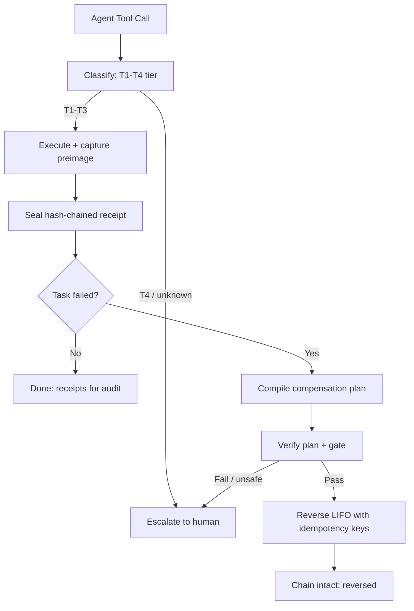

# LatticeAG VekRevert 🧬

<p align="center">
  <a href="https://github.com/LatticeAG/vekrevert/blob/main/LICENSE">
    
  </a>
  <a href="https://www.npmjs.com/package/@latticeag/vekrevert">
    
  </a>
  <a href="https://pypi.org/project/latticeag-vekrevert/">
    
  </a>
  <a href="https://github.com/LatticeAG/vekrevert/stargazers">
    
  </a>
  <a href="https://github.com/LatticeAG/vekrevert/issues">
    
  </a>
  <a href="https://github.com/LatticeAG/vekrevert">
    
  </a>
</p>

<p align="center">
  <b>The compensating-transaction layer for agent side effects.</b><br/>
  Classify. Execute. Seal. Reverse - or escalate.
</p>

<p align="center">
  <a href="#quick-start">Quick Start</a> ·
  <a href="#why-vekrevert">Why VekRevert</a> ·
  <a href="#how-it-works">How It Works</a> ·
  <a href="#features">Features</a> ·
  <a href="#configuration">Configuration</a> ·
  <a href="#related-work">Related Work</a>
</p>

---

Autonomous agents have a forward gear and no reverse. A multi-step task fails
midway and leaves partial side effects behind: money moved but the record never
written, rows mutated but the notification never sent, files rewritten but the
deploy never finished. Retrying double-applies what already succeeded, and no
ledger records what actually executed - so there is nothing to unwind, only
damage to discover later.

VekRevert treats reversibility as a property of the action, not the agent. Every
tool call is classified into a four-tier taxonomy, what actually executed is
sealed into a hash-chained receipt ledger, and reversal runs verified
compensating transactions in reverse order with idempotency keys - or escalates
to a human when no safe compensation exists.

Built from the undo instinct behind [localhosting:3000](https://localhosting3000.vercel.app),
grown into production infrastructure.

## Why VekRevert

- **Designed for irreversible environments** - when a half-finished task leaves money moved, rows mutated, or messages sent.
- **Selective undo, not snapshots** - reverses exactly the effects that landed, without touching anything else. A snapshot restores the world; VekRevert unwinds the action.
- **Proof, not promises** - every execution seals a tamper-evident, hash-chained receipt. `verify` detects edited history. Forensics can always distinguish builtin, registered, and drafted compensations by origin.
- **Default-deny classification** - unknown actions start at T4 (escalate) and only evidence lowers the tier. Shell one-liners and unclassifiable calls never get a free pass.
- **Two languages, one semantics** - TypeScript and Python SDKs pinned by cross-language conformance vectors, so reversal means the same thing everywhere.
- **Measured, not marketed** - 306 TypeScript tests + 35 Python tests including crash injection, chain tampering, lease races, and a 200-case red-team set. See [`docs/eval.md`](docs/eval.md) for numbers on real traces.

### How VekRevert is different

- **Compensation, not checkpoints** - LangGraph-style checkpointers rewind the agent's *internal* state. They cannot un-charge a card or un-send a message. VekRevert reverses effects in the world.
- **Runtime-derived, not hand-written** - classic saga frameworks (Temporal, Step Functions) need compensations declared at authoring time. Agents pick tools at runtime, so VekRevert classifies and seals at execution time, when the concrete result (row IDs, charge tokens, message handles) actually exists.
- **Signed and fenced** - the compensator registry signs what may reverse production effects; leases fence concurrent compensators; idempotency keys make retries safe. Undo you cannot trust is worse than no undo.
- **Escalation as a first-class state** - a failed or unsafe compensation is an explicit `in_doubt` outcome routed to a human (via the VekInbox boundary), never a silent drop.

## Quick Start

```bash
# 1. Install the SDKs (v0.5.0 on both registries)
npm install @latticeag/vekrevert
pip install latticeag-vekrevert

# 2. Wrap a workflow in a saga with a sealed ledger
vekrevert init ./my-workflow
vekrevert execute <plan-id>
# -> each step sealed as a hash-chained receipt

# 3. On failure: reverse in LIFO order, or escalate
vekrevert undo <effect-id>
# -> verified compensations run in reverse; unsafe steps escalate

# 4. Audit any time
vekrevert verify <plan-id>
vekrevert receipts
```

Or from source (monorepo with CLI, both SDKs, bench, and conformance):

```bash
git clone https://github.com/LatticeAG/vekrevert.git
cd vekrevert
pnpm install
pip install -e sdk-python
pnpm test            # 306 TypeScript tests
python -m pytest sdk-python/tests   # 35 Python tests
```

## How It Works



## Features

### Core Layer

| Feature | Description |
|---------|-------------|
| **Four-tier taxonomy** | T1-T4 reversibility classification on the rule-based hot path; unknown starts at T4 and only evidence lowers it. |
| **Sealed receipts** | Hash-chained ledger (SQLite/JSONL/memory) recording what actually executed - tamper-evident, verifiable with `verify`. |
| **Four built-in compensators** | File writes, DB row mutations, HTTP creations, sent messages - plus a signed registry for custom domains. |
| **LIFO reversal** | Verified compensations run in strict reverse order; partial failures propagate as explicit states, never silent success. |
| **Idempotency everywhere** | Retries never double-apply; deterministic keys stable across processes and restarts. |
| **Human escalation** | Unsafe or failed reversals become `in_doubt` and route to a human instead of guessing. |

### Advanced Capabilities

| Feature | Description |
|---------|-------------|
| **Verifier gate** | `off / audit / enforce` modes. Drafted and registered plans need a passing gate record; offline fallback caps at `uncertain` and forces escalation. |
| **Drafted compensations** | Opt-in per-action allowlists (`drafted.allow`), always gate-coupled, provenance-marked end to end. Off by default. |
| **Cross-ledger coordinator** | Per-resource short-TTL leases across processes and ledgers (`vekrevert coordinate` + `coordinatorUrl`). Not a global lock manager. See [`docs/coordination.md`](docs/coordination.md). |
| **Dual-SDK parity** | `@latticeag/vekrevert` and `latticeag-vekrevert` held identical by conformance vectors. |
| **Full CLI** | init, plan, execute, undo, verify, receipts, replay, bench, doctor, registry, escalate, and more. |
| **Red-team fixtures** | 200-case adversarial set plus crash injection, lease fencing, and chain-tamper suites. |
| **Real-trace eval** | Frozen Hermes-shaped trajectories scored on reversal rate, false escalation, chain integrity, and latency. See [`docs/eval.md`](docs/eval.md). |

### Reversibility Tiers

| Tier | Meaning | Example |
|------|---------|---------|
| T1 | Safest: cleanly reversible | Local file restore from captured preimage |
| T2 | Reversible with conditions | DB row restore when no concurrent writer touched it |
| T3 | Compensable with residue | Refund issued, cancellation sent - trace remains |
| T4 | Escalate | Shell one-liners, unknown tools, deletes without preimage |

## Example

An agent overwrites `invoice.txt` mid-task, then the task fails:

```bash
# The write lands and seals receipt fs.write.../invoice.txt
# Undo replays the verified compensation:
vekrevert undo <effect-id>
# -> file restored byte-identical to preimage, chain still verifies
```

What you get:

- A sealed receipt for every executed effect (action, observed args, preimage reference)
- A compiled compensation plan with provenance (`builtin` / `registered` / `drafted`)
- LIFO execution with idempotency keys - safe to retry the undo itself
- An explicit verdict: reversed, partially reversed with named remainders, or escalated
- A ledger that still verifies after all of it

## Configuration

`vekrevert.config.json` (env-overridable with `VEKREVERT_*`):

```json
{
  "ledger": "sqlite:./.vekrevert/ledger.db",
  "allowDrafted": false,
  "drafted": { "allow": ["fs.*", "message.*"], "requireGate": true },
  "verification": { "mode": "audit", "budgetPerSaga": 100 },
  "coordinatorUrl": null
}
```

| Key | Default | What it does |
|-----|---------|--------------|
| `allowDrafted` | `false` | Master switch for drafted compensations |
| `drafted.allow` | `[]` | Action globs permitted to draft (rest hit `VR4005`) |
| `verification.mode` | `audit` | `off` / `audit` (record, never block) / `enforce` (block on failing gate) |
| `coordinatorUrl` | unset | Cross-ledger fencing endpoint; unset means in-ledger leases only |

See [`.env.example`](.env.example) for all values. Never commit real credentials.

## Related Work

Undo for agents is a young, crowded space; VekRevert is a contender, not the inventor.
The saga pattern dates to Garcia-Molina & Salem (1987). For agent runtimes specifically:

- **[agent-saga](https://github.com/thomasjgeorge23/agent-saga)** - closest conceptually: typed semantics, runtime-derived compensations, pre-flight gate, lease-based crash recovery. Independently landed several of the same insights.
- **[toffoli](https://github.com/theo-ai-lab/toffoli)** - classification measured as an eval with per-class precision/recall; dependency-DAG ordering instead of naive LIFO - a critique our eval work answers directly.
- **RAC (arXiv:2605.03409)** and **IBM STRATUS (arXiv:2506.02009)** - academic prior art on log-based compensation and pre-act gating.
- **Temporal / Restate / Inngest / DBOS** - durable-execution incumbents with hand-written sagas; their compensations are statically declared, which breaks down when agents pick tools at runtime.
- **LangGraph checkpointers** - rewind agent state, not world effects. A feeder and a fallback, not a replacement.

## File Tree

```text
vekrevert/
├── README.md                         # This file
├── SPEC-V1-GAPS-EVAL.md              # Build spec (gitignored, never pushed)
├── packages/
│   ├── core/                         # Taxonomy, chain, plans, registry types
│   ├── compensators/                 # fs_write, sql_row, http_create, message_send
│   ├── cli/                          # vekrevert command (15 verbs)
│   └── events-ext/                   # Event extensions
├── sdk-ts/                           # @latticeag/vekrevert (npm)
├── sdk-python/                       # latticeag-vekrevert (PyPI)
├── tests/                            # 306 tests: conformance, red-team, crash injection
├── bench/                            # Benchmarks + real-trace eval harness
├── conformance/                      # Cross-language frozen vectors
├── docs/
│   ├── eval.md                       # Measured numbers on real traces
│   ├── coordination.md               # Cross-ledger protocol
│   └── parity.md                     # SDK parity notes
└── LICENSE                           # MIT
```

## Known Issues

- **Cross-ledger needs a coordinator** - two processes with separate SQLite ledgers sharing one resource are protected only by idempotency keys + VR5006 conflict detection until `coordinatorUrl` is set.
- **Verifier needs a model** - with no reachable model the structural fallback caps verdicts at `uncertain` and forces escalation. Correct, but chatty.
- **Drafted stays off by default** - deliberate. Opt in per action family, keep the gate coupled.
- **Source-install sharp edges** - registry packages track releases; `main` may run ahead (coordinator, eval harness). Pin versions in production.

## License

MIT - see [LICENSE](LICENSE). Copyright (c) 2026 LatticeAG.
